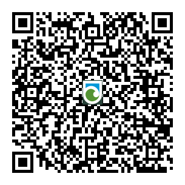

# Install the App

# AR4 NFC Instructions V1.0

**Version: 1.50**  
**Date: 10/2021**  
**Contact:** [electronics@doc.govt.nz](mailto:electronics@doc.govt.nz)

## Introduction

This manual serves as a guide for installing and utilizing the NFC programming capability of the AR4 acoustic recorders, especially when configuring multiple units with identical settings.

The AR4 acoustic recorder, developed by the Department of Conservation's electronics team, offers New Zealand conservation practitioners a high-quality, cost-effective solution. Designed to be lightweight, weatherproof, compact, and user-friendly, it includes built-in recording protocols for standardized monitoring. The recorder operates on readily available, low-cost consumables (**AA batteries and SD cards**) and features an integrated GPS receiver for precise location tracking and timestamping of recordings.

## Requirements

- **Android Phone with NFC Capability**  
  Ensure your phone supports NFC; look for the NFC logo in the quick settings menu.
- **AR4 with Firmware 1.50 or Higher**  
  Verify if your AR4 can be upgraded to version 1.5 or above by visiting [www.doc.govt/electronics](https://www.doc.govt/electronics).

## Installing AR4 Manager (Android Only)

### 1. Download and Install

- Open the **Google Play Store** on your Android device.
- Search for **"AR4 Manager"**.
- Select and install the application.

### 2. Launch the App

- Open the app upon installation completion.
- If NFC is disabled, a prompt will appear. Enable NFC in your phone's **quick settings**.

## AR4 Components Overview

- **Microphone**
- **Locking Thread**
- **LCD Screen**
- **Buttons**
- **SD Card Slot**
- **Shell**
- **Batteries**
- **GPS Module**
- **Seal**
- **Locking Ring**
- **Identification Label**
- **Bull Bar**
- **Clock Backup Battery** (for AR4 units produced after 01/2021)
- **NFC Logo**: Indicates NFC capability; located beneath the SD card slot.

## Using the AR4 Manager App

### **Timetable Tab**

Configure up to **six recording start times**. Each entry includes:

- **Protocol**: Options include High, Low, Bat, Tier1, etc.
- **Start Time**: Set the desired start time.
- **Span Time**: Define the duration of the recording.
- **Enable/Disable Toggle**: Activate or deactivate specific recording periods.

#### **Instructions**

**1. Add a Start Time**

- Tap **"ADD"** in the top-right corner to create a new entry.

**2. Remove a Start Time**

- Highlight the desired entry by tapping on it.
- Tap **"REMOVE"** to delete it.

**3. Edit a Start Time**

- Double-tap the entry to modify settings.
- Adjust the protocol, start time, and span time as needed.
- Tap the **back arrow** in the top-left to save changes.

> **Note**: If more than two start times are programmed, these additional slots will be editable in the AR4 menu. To revert to the default two start times:
>
> - Reprogram via the app with **0-2 start times** enabled.
> - Set the protocols for each start time to **"OFF"** in the AR4 menu, then cycle through the full menu once.

### **Options Tab**

Additional configurable settings:

- **GPS Settings**:
  - **OFF**: Disable GPS logging.
  - **Log Only**: Save GPS position to a log file after each recording session.
  - **Log & Sync**: Save GPS position and synchronize the AR4 clock with the current GPS time.

- **Tier1 Settings**:
  - Applicable for **DOC internal Tier1 surveys**. These settings are relevant only if **"Tier1"** is selected as the recording protocol in the Timetable tab.

### **Program Tab**

To program the settings into the AR4:

#### **1. Preparation**

- Ensure all settings are correct.
- Verify that the desired recording periods are enabled in the **Timetable** tab.

#### **2. Programming**

- **Power on** the AR4 and navigate to its menu (**display should be active**).
- **Note**: The menu will timeout; press the **page button periodically** to keep it active.
- Tap the **"Connect and Update"** button in the app.
- Hold your **phone over the SD card slot** on the AR4.
- A **green checkmark** will confirm successful programming, and a message will appear on the AR4 display.

#### **3. Verification**

- Cycle through the timetable on the AR4 to ensure settings are correctly applied.

## **Deployment**

After programming:

- **Power off the AR4**.
- **Deploy the unit** as required for your monitoring activities.

## **Feedback and Support**

For feedback or assistance, contact the **DOC electronics team** at [electronics@doc.govt.nz](mailto:electronics@doc.govt.nz).

## **Basic Specifications**

- **Weight**: 370 grams (with batteries)
- **Acoustic Sampling Rates**:
  - **High**: 32 kHz at 16-bit resolution (WAV files)
  - **Low**: 8 kHz at 16-bit resolution (WAV files)
  - **Bat**: Proprietary 0-88 kHz compressed spectrogram bitmap
- **Batteries**: 4x AA NiMH or Alkaline (**NiMH recommended**)
- **Memory Cards**: SD cards up to **32 GB** (**16 GB recommended**)
- **Recording Times** (approximate with NiMH batteries):
  - **Acoustic High**: ~120 hours
  - **Acoustic Low**: ~180 hours
  - **Bat (Deployment Time)**: Up to **4 weeks** (duration may decrease with high levels of bat activity)

---

*For the most current information and updates, refer to the official documentation provided by the Department of Conservation.*
